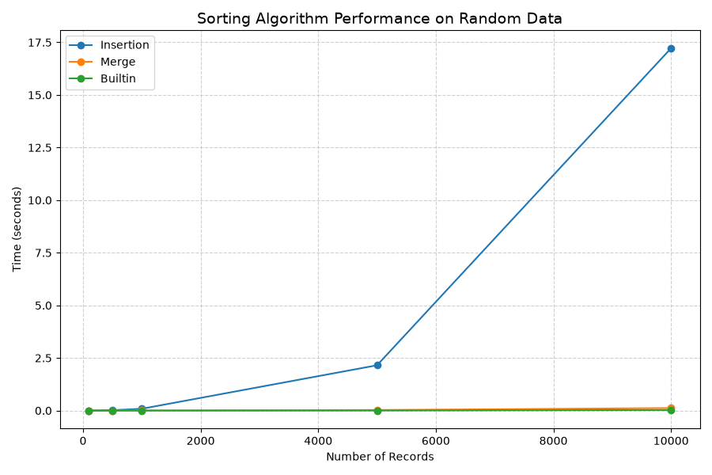
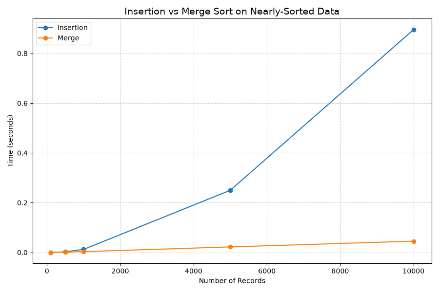

<div align="center">

# ⚡ Adaptive Sorting & Searching System

**A sorting/searching system that automatically selects the best algorithm based on data size and how sorted the data already is — instead of blindly running one fixed algorithm every time.**

[](https://python.org)
[](https://matplotlib.org)
[](LICENSE)

[📂 Source Code](https://github.com/syedibrahimdev/Adaptive-Data-Sorter) · [🐛 Report Bug](https://github.com/syedibrahimdev/Adaptive-Data-Sorter/issues)

</div>

---

## 🧐 Why Adaptive Sorting Matters

Most sorting tutorials teach one algorithm and stop there. But in real systems — databases, search indexes, caching layers — the *same* dataset rarely stays in the same state. Sometimes it's freshly randomized, sometimes it's 95% sorted with a few new inserts, sometimes it's already fully sorted from a previous operation.

Running the same algorithm regardless of that context wastes time:
- **Merge Sort** is reliably fast (`O(n log n)`) on random data, but pays unnecessary overhead on data that's already nearly sorted.
- **Insertion Sort** is terrible on random data (`O(n²)`), but on nearly-sorted data it approaches `O(n)` — almost free.
- If data is **already sorted**, sorting it again at all is wasted work.

This project builds a system that checks the data's current state first, then picks the algorithm that actually fits — exactly the kind of decision real-world systems (like Python's own `sort()`, which uses Timsort internally) make automatically.

---

## 📊 Algorithm Comparison

| Algorithm | Best Case | Average Case | Worst Case | Space | Adaptive? |
|-----------|-----------|---------------|------------|-------|-----------|
| **Insertion Sort** | O(n) | O(n²) | O(n²) | O(1) | ✅ Yes — fast on nearly-sorted data |
| **Merge Sort** | O(n log n) | O(n log n) | O(n log n) | O(n) | ❌ No — same cost regardless of input order |
| **Skip (already sorted)** | O(n) check | O(n) check | O(n) check | O(1) | ✅ Yes — avoids sorting entirely |
| **Binary Search** | O(1) | O(log n) | O(log n) | O(1) | Requires sorted data |

> **Adaptive** here means an algorithm's runtime improves when the input is already partially ordered — Insertion Sort is naturally adaptive, Merge Sort is not (it does the same divide-and-conquer work no matter what).

---

## 🧠 How This System Decides

                ┌─────────────────────┐
                │   Is data sorted?    │
                └──────────┬───────────┘
                      Yes ──┴── No
                       │         │
                 Skip sort       ▼
                (return early)  ┌──────────────────────┐
                                │  n <= 50 (small)?     │
                                └──────────┬────────────┘
                                      Yes ──┴── No
                                       │         │
                                Insertion Sort   ▼
                                            ┌─────────────────────────┐
                                            │ Nearly sorted?           │
                                            │ (sampled inversion       │
                                            │  ratio <= 10%)           │
                                            └──────────┬───────────────┘
                                                  Yes ──┴── No
                                                   │         │
                                            Insertion Sort  Merge Sort

**Why sample instead of checking every element?** Counting exact inversions across the whole array is itself `O(n²)` in the naive case — checking the entire array to decide *how* to sort it would defeat the purpose. Instead, the system samples adjacent pairs at intervals, giving a fast `O(sample size)` estimate of how "out of order" the data roughly is.

---

## 📈 Benchmark Results

### Random Data — All Algorithms


On fully randomized data, Merge Sort and Python's built-in Timsort scale predictably with `O(n log n)`, while Insertion Sort's `O(n²)` cost grows sharply as `n` increases — this is exactly why the system avoids Insertion Sort once the dataset is large.

### Nearly-Sorted Data — Insertion vs Merge


Here the picture flips: Insertion Sort's adaptive nature lets it finish in close to linear time, often beating Merge Sort despite Merge Sort's better worst-case guarantee — because Merge Sort always does the same amount of work, sorted or not.

---

## ✨ Features

| Feature | Description |
|---------|-------------|
| 🔍 Sortedness Detection | O(n) check to skip sorting entirely if data is already ordered |
| 📏 Size-Based Selection | Small datasets use low-overhead Insertion Sort |
| 🎯 Inversion Sampling | Estimates how "nearly sorted" data is without full O(n²) scan |
| 🔀 Merge Sort Fallback | Used for large, genuinely unordered datasets |
| 🔎 Binary Search | O(log n) search once data is confirmed sorted |
| 📊 Benchmark Suite | Generates real performance comparison charts |

---

## 📁 Project Structure
Adaptive-Data-Sorter/

│

├── AdaptiveSSS.py     # Core system: CompositeKey, sorting strategies, search

├── benchmark.py        # Generates performance comparison charts

├── images/

│   ├── benchmark_random.png

│   └── benchmark_nearly_sorted.png

└── README.md

---

## 🚀 Getting Started

```bash
# 1. Clone the repo
git clone https://github.com/syedibrahimdev/Adaptive-Data-Sorter.git
cd Adaptive-Data-Sorter

# 2. Install dependencies
pip install matplotlib

# 3. Run the main demo
python AdaptiveSSS.py

# 4. (Optional) Regenerate benchmark charts
python benchmark.py
```

---

## 🖥️ How to Use

```python
from AdaptiveSSS import AdaptiveSortingSearchingSystem, CompositeKey

system = AdaptiveSortingSearchingSystem('composite')
system.insert(CompositeKey(2, "Ibrahim"))
system.insert(CompositeKey(1, "Arham"))

system.sort_data()
print(f"Algorithm chosen: {system.last_algorithm_used}")

found = system.search(CompositeKey(1, "Arham"))
print("Found:", found)
```

---

## 🔧 Tech Stack

| Layer | Technology |
|-------|-----------|
| Language | Python 3.9+ |
| Visualization | Matplotlib |
| Core Concepts | Algorithm analysis, Big-O complexity, adaptive algorithm selection |

---

## 🗺️ Roadmap

- [x] Insertion Sort + Merge Sort implementation
- [x] Sortedness detection (skip redundant sorts)
- [x] Inversion-ratio sampling for "nearly sorted" detection
- [x] Benchmark suite with comparison charts
- [ ] Add Quick Sort as a third strategy option
- [ ] Add Timsort-style hybrid (insertion sort on small sub-runs within merge sort)
- [ ] CLI flag to force a specific algorithm for testing

---

## 🤝 Contributing

Pull requests are welcome. For major changes, open an issue first to discuss what you'd like to change.

---

## 👨‍💻 Author

**Syed Ibrahim Ahmed**
[](https://github.com/syedibrahimdev)
[](https://linkedin.com/in/syedibrahimdev)

---

<div align="center">
  <sub>Built to understand why "the fastest algorithm" depends on the data, not just the textbook</sub>
</div>
>>>>>>> 0f0cb17 (Add multi-algorithm adaptive selection, benchmark suite, full README)
